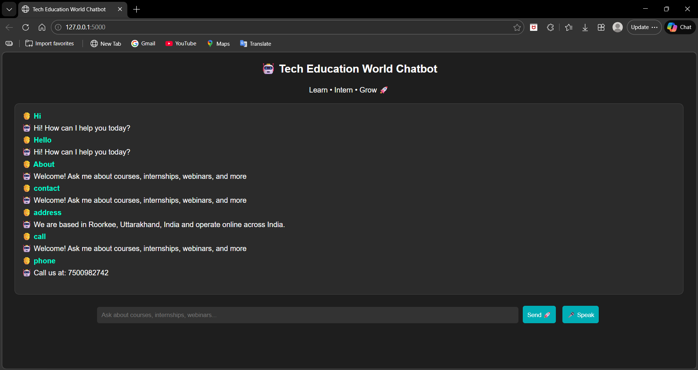

# 🤖 Tech Education World Chatbot

An AI-powered chatbot developed for **Tech Education World** to assist students with queries, learning resources, internships, and guidance.

---

## 🚀 Features

* 💬 Interactive Chat Interface (Web + GUI)
* 🧠 AI-based Intent Recognition (ML Model)
* 🎤 Voice Input & Output Support
* 📚 Provides courses, internships & webinar info
* ⚡ Fast and user-friendly responses
* 🎯 Designed for students and learners

---

## 🛠️ Technologies Used

* Python 🐍
* Flask (Web Backend)
* Tkinter (Desktop GUI)
* Machine Learning (Naive Bayes + TF-IDF)
* HTML, CSS, JavaScript (Frontend)

---

## 📂 Project Structure

```
├── app.py                # Flask backend
├── index.html           # Web interface
├── chatbot_model.py     # Response logic
├── train_model.py       # ML training script
├── model.pkl            # Trained model
├── vectorizer.pkl       # TF-IDF vectorizer
├── chatbot_gui.py       # Desktop chatbot
├── voice_chatbot.py     # Voice assistant
└── README.md
```

---

## ▶️ How to Run Locally

### 1️⃣ Clone Repository

```
git clone https://github.com/your-username/techeducationworld-chatbot.git
cd techeducationworld-chatbot
```

### 2️⃣ Install Dependencies

```
pip install flask scikit-learn pandas
```

### 3️⃣ Run the Web Chatbot

```
python app.py
```

👉 Open browser:

```
http://127.0.0.1:5000
```

---

## 🎤 Run Voice Chatbot

```
python voice_chatbot.py
```

---

## 🖥️ Run GUI Chatbot

```
python chatbot_gui.py
```

---

## 🎯 Purpose

This chatbot is built to support the mission of **Tech Education World** by providing **free learning, internships, webinars, and career guidance** to students.

---

## 📸 Screenshots



---

## 📧 Contact

**Mohd Shahnawaz**
Founder & CEO – Tech Education World
📩 Email: [techedu.world1@gmail.com](mailto:techedu.world1@gmail.com)

---

## ⭐ Support

If you like this project, give it a ⭐ on GitHub and share it!

---
